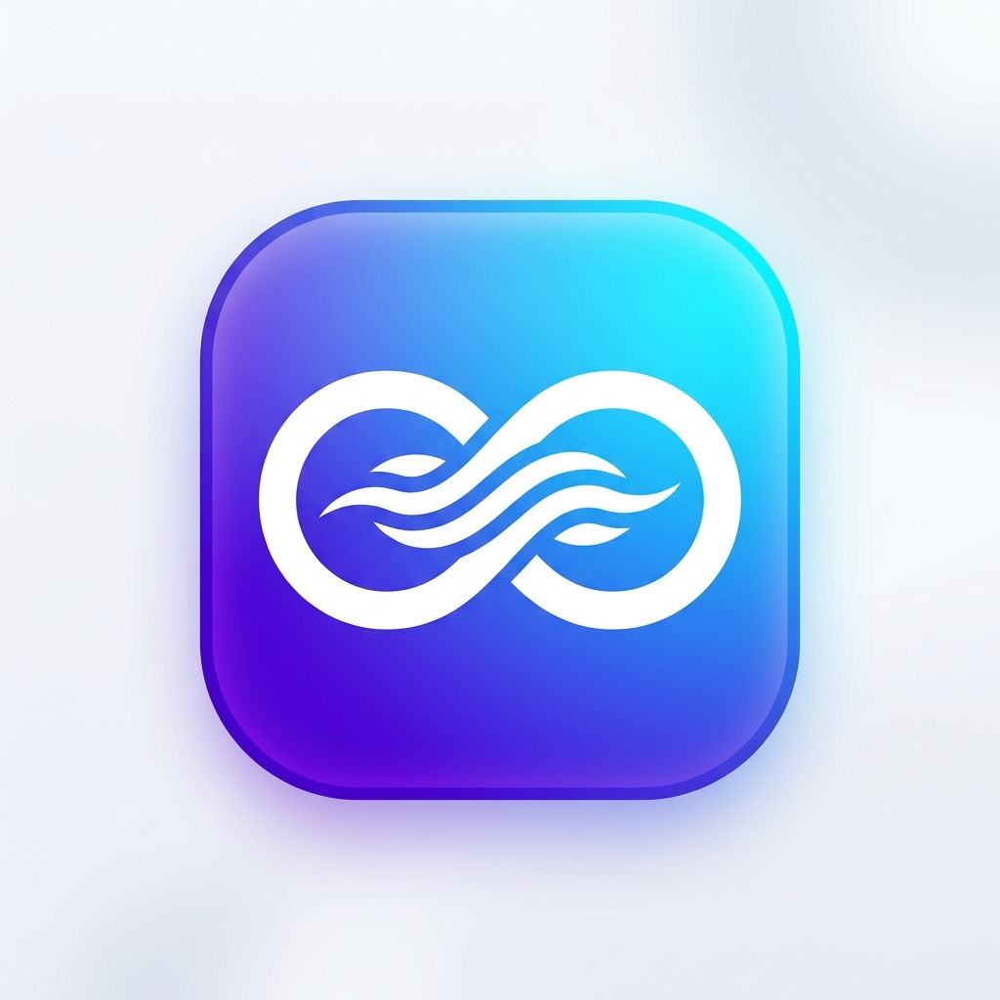
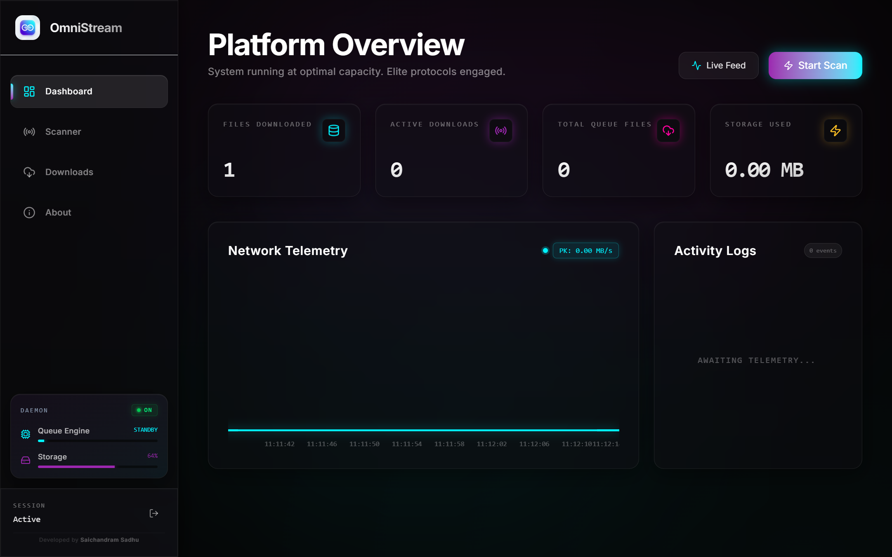
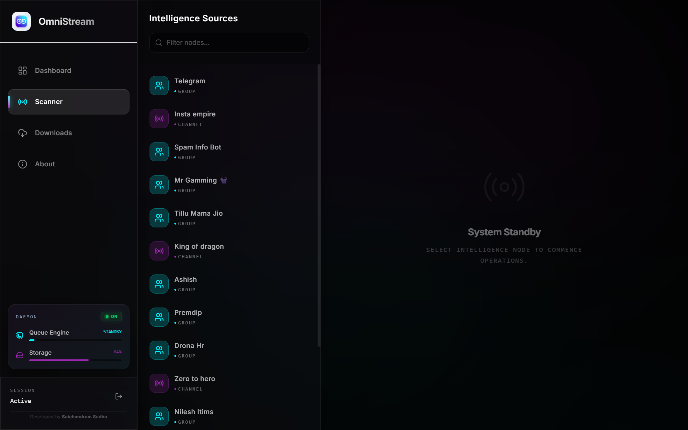
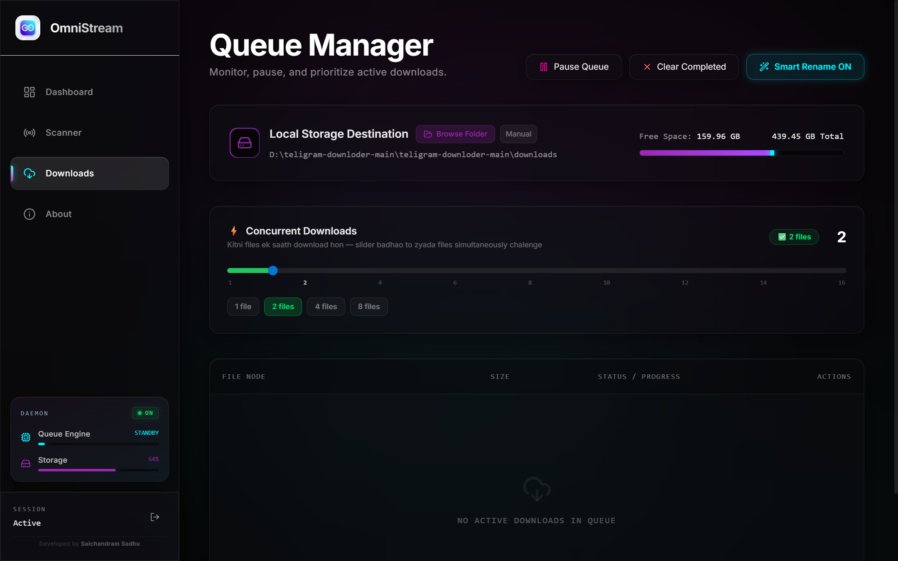

<div align="center">
  
  <h1>🚀 OmniStream ⚡</h1>
  <p><strong>A Next-Gen Local Telegram Media Downloader & Queue Manager</strong></p>

  <p>
    <a href="#"></a>
    <a href="#"></a>
    <a href="#"></a>
    <a href="#"></a>
    <a href="#"></a>
  </p>

  <p>
    OmniStream is an ultra-fast, local-first Telegram media scraper and downloader. Built with a stunning <i>Glassmorphism</i> UI and engineered for performance, it allows you to scan groups/channels, queue thousands of episodes sequentially, and download them directly to your hard drive at maximum speed.
  </p>
</div>

---

## ✨ Features

- 🔐 **Secure Local Authentication**: Login securely using your phone number and 2FA. Credentials never leave your machine!
- 🔍 **Deep Media Scanner**: Automatically indexes all audio, video, documents, and archives from any Telegram channel or group.
- ⚡ **Sequential Queue Engine**: Downloads episodes in exact order (FIFO - Episode 1, then Episode 2) so you never lose track.
- 🚀 **Adjustable Download Workers**: Change from 1 to 16 parallel file connections on-the-fly to maximise your internet bandwidth.
- 🧠 **Smart Rename Engine**: Automatically cleans messy filenames into a beautiful, standardized `[Ep N] - Title` format.
- 💾 **Local File System Integration**: Pick your exact local download directory using a native file browser. No cloud limits!
- 📱 **Fully Responsive UI**: Stunning cyber-neon UI that perfectly scales from Desktop monitors down to Mobile phones.

---

## 📸 Interface Showcases

### 🛡️ Secure Login Gateway


### 📊 Real-Time Telemetry Dashboard


### 📡 Channel Media Scanner


### 📥 Intelligent Queue Manager


---

## ⚙️ Installation (Standalone Windows .exe)

The easiest way to use OmniStream is to download the standalone Windows application.

> **⚠️ IMPORTANT: How to fix "Windows protected your PC" or Smart App Control blocks**
> 
> Because this is a free open-source app, it does not have a paid Microsoft Code Signing Certificate. Windows will flag it as "Unknown" when downloaded from the internet. 
> To run it without any errors or blocks:
> 1. Download the `OmniStream Setup X.X.X.exe` file.
> 2. **Right-click** the file and select **Properties**.
> 3. At the bottom of the General tab, check the box that says **"Unblock"**.
> 4. Click **Apply** and **OK**.
> 5. Double-click the file to install and run! It will now work perfectly without Smart App Control blocking it.

---

## 🛠️ Development & Manual Deployment (Local)

**Why Localhost instead of Cloud Deployment (Render/Vercel/Heroku)?**
> OmniStream is designed to download heavy media files directly to your PC's hard drive. If deployed to a free cloud server, files would download to the server's cloud storage (which usually has strict 500MB limits on free tiers), and you would have to re-download them again to your PC. 
> 
> Therefore, **the best, fastest, and FREE way** to use this is running it directly on your machine!

### Prerequisites
- Node.js (v18 or higher)
- A Telegram Account

### Quick Start

1. **Clone the repository:**
   ```bash
   git clone https://github.com/your-username/OmniStream.git
   cd OmniStream
   ```

2. **Install all dependencies:**
   ```bash
   npm install
   ```

3. **Set up Environment Variables:**
   - Go to [my.telegram.org](https://my.telegram.org) to get your `API_ID` and `API_HASH`.
   - Create a `.env` file in the root directory:
     ```env
     TELEGRAM_API_ID=your_api_id
     TELEGRAM_API_HASH=your_api_hash
     ```

4. **Launch the OmniStream Server & UI:**
   ```bash
   npm run dev
   ```

5. **Open in Browser:**
   Navigate to `http://localhost:5173` to access the portal!

---

## 🛠️ Tech Stack & Architecture

- **Frontend:** React 18, Vite, Framer Motion (for buttery smooth animations), Tailwind CSS v4, Recharts (for telemetry).
- **Backend:** Node.js, Express, GramJS (for deep Telegram MTProto API integration).
- **Database/Storage:** Local memory stores + JSON-based persistent states (Zero setup required).
- **Design System:** Custom Neon-Glass UI with fully dark-mode responsive styling.

---

## 🤝 Developed By

**Saichandram Sadhu**  
*Full-Stack Developer · Telegram Tool Builder*  
Made with ❤️ for the open-source community.
